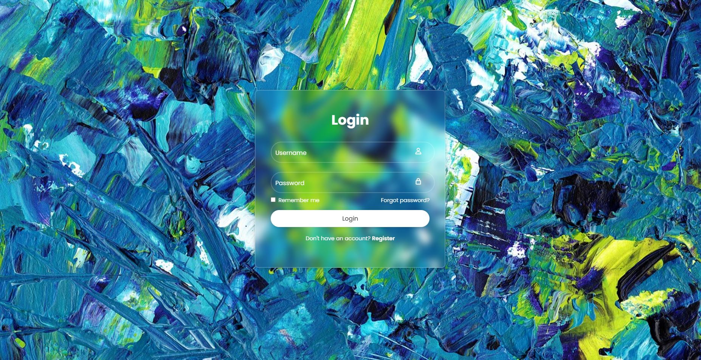

# Login-Page
HTML/CSS 

A simple and elegant Login Form built using HTML5 and CSS3. This project demonstrates the use of modern front-end design concepts such as glassmorphism, responsive layout, custom fonts, and icons.

## Features

Responsive and modern login interface

Glassmorphism effect using backdrop-filter

Boxicons integration for user and lock icons

Styled buttons, input fields, and hover effects

Includes a “Remember Me” checkbox and Forgot Password link

Uses a Google Font (Poppins) for a clean, professional look

## Technologies Used

HTML5 – for structure and content

CSS3 – for styling and visual effects

Boxicons CDN – for icons

Google Fonts – for typography

## Project Structure
login-form/
│
├── index.html        # Main HTML file (Login form structure)
├── style.css         # CSS file (Styling and layout)
├── paint.jpg         # Background image (replaceable)
└── README.md         # Project documentation

## How to Use

Download this repository.

Make sure the index.html and style.css files are in the same folder.

Open index.html in your browser to view the login form.

Optionally, replace the background image (paint.jpg) with your own.

## Customization

To change the background image, replace paint.jpg with your preferred image and update the CSS:

background: url('your-image.jpg') no-repeat;

To change the font, edit the Google Fonts import line in style.css.

You can adjust the button color, border radius, or blur intensity by editing values in .btn and .wrapper.

## Note

This login page is for design and demonstration purposes only — it does not connect to a real authentication backend. To make it functional, you can integrate it with JavaScript, Node.js, PHP, or any server-side technology later.

## Preview

.

## Author

Julie Tran
